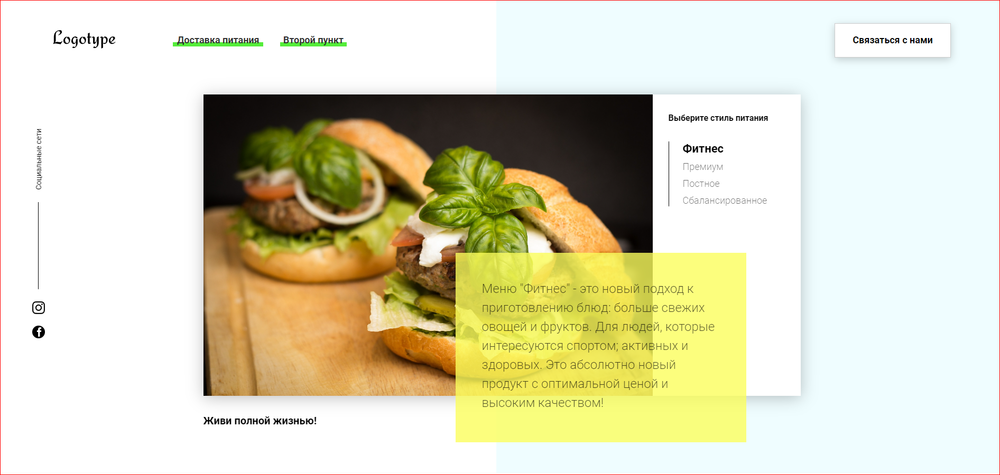

#FOOD

Всем привет!

Реализация этого скрипта будет основана на готовой верстке учебного проекта FOOD. На данном сайте будут проработаны табы, формы, слайдер, калькулятор, таймер и много других моментов.

В этом первом коммите я реализовала табы для выбора меню по изученной мной теме ClassList и делегирование событий.

***

Изучила сразу несколько тем:

- Скрипты и время их выполнения. setTimeout и setInterval
- Сборщик мусора и утечки памяти
- WeakMap и WeakSet
- Работа с датами

И в этом коммите я сделала таймер установленный для оповещения об окончании акции используя setInterval.

***

